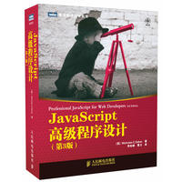

<a id="#1"></a>

## 前端是什么

在判断自己是否喜欢一个东西之前,我们最常用的办法是了解他。

在9012年,前端的定义大概为:负责人机交互的工程师,那么无论是Android&ios的界面亦或是Web网页,甚至是Desktop端,都可以被前端囊括。

将数据,复杂操作转化为优雅、简洁的界面就是前端所肩负的责任。

>Web前端开发，也称为客户端开发，是为网站或Web应用程序生成HTML、CSS和JavaScript的实践，以便用户可以直接看到它们并与之交互。与前端开发相关的挑战是，用于前端创建网站的工具和技>术不断变化，因此开发者需要持续了解该领域是如何发展的。
>设计一个网站的目的，就是确保当用户打开网站时，看到的信息被格式化成易于阅读且相关联的。更复杂的是，现在用户使用大量、不同的屏幕尺寸和分辨率的设备，从而迫使设计师在设计网站的时
>候不得不考虑这些问题，他们需要确保页面能够在不同的浏览器(跨浏览器)、不同的操作系统(跨平台)和不同的设备(跨设备)中正确运行，这就需要开发者进行仔细的规划。
>— 维基百科

<a id="#2"></a>

## 起步


好了扯远了,说的那么复杂,总要有个开始吧。

我的建议就是既然在上一步过程中明确了自己喜欢前端,那么就继续,先别问为什么。

打开Chrome,按下```F12```,如果你是Mac,那么按```option + command + i```

这时弹出一个控制台,输入下面代码

```js
alert("hello world");
```

如上所示,短短的一行代码,就能在浏览器上见到效果,这也是前端的魅力所在。

事实上,前端的学习曲线远比上面的图中的曲线让人难以接受,前端的学习进度会越来越陡峭,但是你在顶端看见的风景也会越来越美好。

<a id="#3"></a>

## 基础学习

前端基础包括Html,Css,JavaScript

其中Html以及Css建议阅读W3school的文档教程[Html](http://www.w3school.com.cn/html/index.asp),[Css](http://www.w3school.com.cn/css/index.asp)

并且自己使用记事本编辑尝试一遍,这样可以快速对Html和Css有一个大概的认知

然后可以搜索[模板之家](http://www.cssmoban.com/)

找上面的一些简单的例子试着去模仿,如果无从下手,那么去百度一下如何布局,多用百度,条件允许多用谷歌。

随后,最好买一本小红书,封面如下



嗯,然后从第一章开始看,一边看一边完善之前模仿的简单例子,添加一些交互,不懂的可以多百度或者问我🍺。

若干天以后,大概是两个月至三个月,你会发现,在w3school上面学习的东西似乎有些不够看,那么需要有一个更加完整和权威的Html和Css文档。

这个时候你需要进入[MDN-Html](https://developer.mozilla.org/zh-CN/docs/Web/HTML)、[MDN-Css](https://developer.mozilla.org/zh-CN/docs/Web/CSS)

上面有完善的Html和Css的标签、属性、Api介绍。

同时,这个时候你也应该知道了JavaScript由ECMAScript和BOM、DOM组成,小红书的ECMAScript讲解的很好了,那么如何学习BOM和DOM呢？

按第二部分操作打开浏览器控制台,输入下列代码

```js
for(var item in document){
  console.log(item);
}
for(var item in window){
  console.log(item);
}
```

你会发现浏览器控制台出现了很多BOM、DOM接口,然后在[MDN](https://developer.mozilla.org/zh-CN/docs/Web/JavaScript)查询这些接口怎么使用。

如果你完整的经历了这么一个过程,对于Html5,Css3,ES678都了然于心,那么你的基础已经十分牢固了,这个时候可以进行下一步。

<a id="#4"></a>

## 库学习

我不建议你学JQuery,因为所有JQuery能做到的事情,你用Js就已经能做到了,JQuery能简化你写的代码数量,但是在9102年,已经无法给你的前端工程化提供太多帮助。

我建议你在学完基础之后,模仿几个自己感兴趣的网站。就开始这一步的学习。

可能你百度之后,心中有疑问,Vue、React、Angular我学哪个？

你可以投骰子,也可以写个随机数,这时你可以很轻松的写出下面的代码

```js
let num = 
    parseInt(Math.random() * 3) == 0 ? 
    'Vue' : 
    parseInt(Math.random() * 3) == 1 ? 
    'React' : 'Angular';
console.log(num);
```

然后得到一个上天给你的结论,开始学习吧。

<a id="#5"></a>

## Vue学习

首先推荐看看尤大大在知乎上的回答,[如何学习Vue](https://zhuanlan.zhihu.com/p/23134551)

<a id="#6"></a>

## React学习

建议不要看那些乱七八糟学React的视频,虽然有些讲得很好,但是很多已经过时且容易让你误导。

跟着官网的例子,如果英文不好,那么就看中文版,最好和最新的英文版对比着看。

学习库可以直接看最新的版本,而不用理会以前那些废弃的语法糖。框架每年都可能变,但是基础永远是Js,哦,9102年还有Ts。只要体会到了框架的作用和如何更好地发挥框架的作用,那么就足够了

框架永远都只是<strong>工具</strong>而已

<a id="#7"></a>

## Angular学习

这个我没有学过,等学了再来更新。

<a id="#8"></a>

## 如何进阶

在你学习了上述库中的一个时,你可能会有不同的表现

- 如果你学了Vue,这时候你已经可以用VueCli构建一个自己的项目了,但是Webpack是什么？npm又是什么？这些概念开始出现在你的词典里。

- 如果你开始学习React,这时候你发现甚至不能构建一个项目,我到底该不该用Redux,什么是saga什么是thunk。。。

这个时候,你要用一种无知者无畏的眼光去看事情。

单独的实用Vue或者React能做到的事,为什么还要纠结用什么生态呢？

当然,出于学习的角度<strong>多尝试,多重构你的基础项目</strong>你就会发现其中的奥秘。